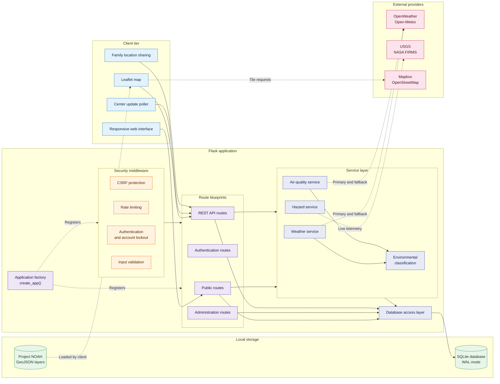
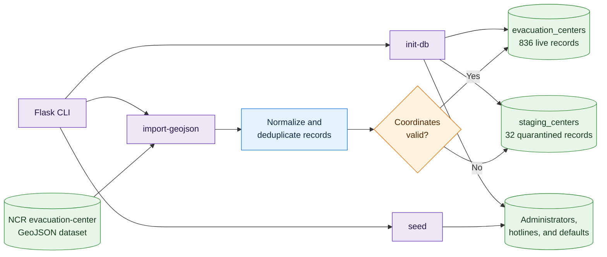

# 🇵🇭 LigtasPH: Integrated Calamity Response & Evacuation Mapping System

[](https://www.python.org/downloads/)
[](https://flask.palletsprojects.com/)
[-lightgrey.svg)](https://www.sqlite.org/)
[](https://leafletjs.com/)
[](tests/)
[](#license)
[](#)

**LigtasPH** is an integrated disaster-information and evacuation-mapping platform for residents, Local Government Units (LGUs), and Disaster Risk Reduction and Management Offices (DRRMOs) across the Philippines.

The platform combines verified evacuation centers, occupancy and relief-supply monitoring, multi-source weather forecasts, PAGASA heat-index classifications, DENR PM2.5 classifications, DOST Project NOAH hazard overlays, earthquake and active-fire feeds, temporary family location sharing, and geo-targeted emergency announcements.

> **Sprint 2 highlight:** LigtasPH includes 836 live evacuation centers across all 17 Metro Manila LGUs, parsed from `data/ncr_evacuation_centers.geojson`. Another 32 ungeocodable records are quarantined for review. Unreported capacity remains `NULL` and displays as `Status Unavailable` rather than a fabricated zero or misleading availability status.

## Table of contents

1. [Features](#features)
2. [Architecture and system design](#architecture-and-system-design)
3. [Quick start](#quick-start)
4. [CLI commands](#cli-commands)
5. [REST API](#rest-api)
6. [Database](#database)
7. [Environmental indicators](#environmental-indicators)
8. [Configuration](#configuration)
9. [Project layout](#project-layout)
10. [Deployment](#deployment)
11. [Security and resilience](#security-and-resilience)
12. [Testing](#testing)
13. [License](#license)

## Features

### Evacuation-center mapping

- 836 live evacuation centers across all 17 Metro Manila LGUs.
- Provenance and review fields: `source`, `verified`, `needs_review`, and `review_reason`.
- Idempotent imports that preserve administrator-updated occupancy and supply counts.
- Honest handling of missing capacity through `NULL` and `Status Unavailable`.
- Client polling through `/api/centers/version` for map, directory, and detail refreshes.
- Leaflet maps with Mapbox terrain rendering and an OpenStreetMap fallback.
- Filters for city, operating condition, occupancy, and critical supplies.

### Hazard overlays and live feeds

- DOST Project NOAH flood, landslide, and storm-surge GeoJSON overlays.
- USGS earthquake telemetry within a configurable 10 to 2,000 km radius.
- NASA FIRMS thermal-anomaly data restricted to the Philippine bounding box.

### Weather and environmental conditions

- OpenWeather forecasts with automatic Open-Meteo fallback.
- Server-side heat-index calculation using the Rothfusz regression equation.
- PAGASA heat-index alert classification.
- PM2.5 classification under DENR DAO 2020-14, kept distinct from US EPA AQI.
- Fresh cache under 10 minutes, stale cache under one hour, or an honest HTTP `503` response when providers fail.

### Family location sharing and announcements

- Temporary emergency groups with secure six-character invite codes.
- GPS pings with accuracy data and a two-hour expiration period.
- A live radar map for group members and nearby evacuation centers.
- Emergency announcements scoped nationwide, by city, or by Haversine radius.

### Administration

- DRRMO administrator portal with center, hotline, and announcement management.
- Occupancy, supply, stale-record, and city-capacity monitoring.
- Audit records for center updates, including previous and new occupancy values.
- Searchable emergency directory with national and local LGU hotlines.

## Architecture and system design

The main diagram separates runtime requests from storage and third-party data providers. Initialization and GeoJSON ingestion are shown separately because those operations run through Flask CLI commands rather than the normal request path.

### Runtime architecture



### Database initialization and data ingestion



## Quick start

### Prerequisites

- Python 3.11 or later
- `pip` and `venv`
- Git

### Clone and create a virtual environment

```bash
git clone https://github.com/Makusu10/LigtasPH.git
cd LigtasPH
python3 -m venv .venv
```

Activate it:

```bash
# Linux or macOS
source .venv/bin/activate

# Windows CMD
.venv\Scripts\activate

# Windows PowerShell
.venv\Scripts\Activate.ps1
```

### Install, configure, and initialize

```bash
pip install -r requirements.txt
cp .env.example .env

python -m flask --app app init-db
python -m flask --app app seed
python -m flask --app app import-geojson
```

### Run the application

```bash
# Local GUI launcher
python run_gui.py

# Flask development server
python -m flask --app app run --debug

# Production WSGI server
python -m gunicorn wsgi:app --bind 127.0.0.1:8000
```

The development application opens at `http://127.0.0.1:5000`.

### Default local credentials

- Username: `admin`
- Password: `admin123`
- Login: `http://127.0.0.1:5000/admin/login`

> [!CAUTION]
> Change the default username, password, and `SECRET_KEY` before production deployment. Login requests are limited to 10 per minute, and five consecutive failures lock the account for 15 minutes.

## CLI commands

```bash
python -m flask --app app run --debug
python -m flask --app app init-db
python -m flask --app app seed
python -m flask --app app import-geojson
python -m pytest -q
python run_gui.py
python scripts/convert_noah.py
python -m gunicorn wsgi:app
```

## REST API

All API routes use the `/api` prefix.

- `GET /api/centers`: query centers by text, city, status, supply, or sorting rule.
- `GET /api/centers/version`: obtain the latest update timestamp and center count.
- `GET /api/centers/<id>`: retrieve one evacuation center.
- `GET /api/ncr-lgus`: retrieve all 17 NCR LGUs and centroids.
- `GET /api/weather`: retrieve weather and heat-index data by coordinates or city.
- `GET /api/air-quality`: retrieve PM2.5 and AQI data.
- `GET /api/environment`: retrieve combined weather and air-quality severity.
- `GET /api/earthquakes`: retrieve earthquakes within a requested radius.
- `GET /api/fires`: retrieve active thermal anomalies for one or two days.
- `GET /api/announcements`: retrieve announcements filtered by city or location.
- `POST /api/groups`: create a temporary location-sharing group.
- `POST /api/locations`: submit one member's temporary location.
- `GET /api/groups/<code>/locations`: retrieve unexpired group locations.
- `GET /api/hotlines`: search hotlines by city, category, or text.

## Database

SQLite runs with foreign-key enforcement and write-ahead logging. The schema contains 10 main tables:

- `administrators`
- `evacuation_centers`
- `staging_centers`
- `center_status_updates`
- `emergency_hotlines`
- `weather_cache`
- `emergency_groups`
- `live_locations`
- `hazards_cache`
- `announcements`

## Environmental indicators

### PAGASA heat index

The application calculates heat index through the NOAA/NWS Rothfusz regression and maps the result to the following tiers:

- Below 27°C: Not Hazardous
- 27°C to 32°C: Caution
- 33°C to 41°C: Extreme Caution
- 42°C to 51°C: Danger
- 52°C or above: Extreme Danger

### DENR DAO 2020-14 PM2.5 classification

- 0.0 to 25.0 µg/m³: Good
- 25.1 to 35.0 µg/m³: Fair
- 35.1 to 45.0 µg/m³: Unhealthy for Sensitive Groups
- 45.1 to 55.0 µg/m³: Very Unhealthy
- 55.1 to 90.0 µg/m³: Acutely Unhealthy
- Above 91.0 µg/m³: Emergency

Provider failures never produce dummy zeroes. The application returns fresh cache, stale cache within one hour, or HTTP `503 Service Unavailable` with `retry: true`.

## Configuration

Copy `.env.example` to `.env`, then configure these variables as needed:

- `SECRET_KEY`: required in production.
- `FLASK_ENV`: `development`, `production`, or `testing`.
- `DATABASE_URL`: defaults to `instance/ligtas.sqlite`.
- `ADMIN_USERNAME` and `ADMIN_PASSWORD`: required custom values in production.
- `OPENWEATHER_API_KEY`: optional; Open-Meteo is the keyless fallback.
- `MAPBOX_TOKEN`: optional; OpenStreetMap is the fallback.
- `FIRMS_MAP_KEY`: optional NASA FIRMS key.
- `GEMINI_API_KEY`: reserved for future AI assistance.
- `APP_URL`: optional deployed base URL.

## Project layout

```text
LigtasPH/
├── app.py
├── config.py
├── wsgi.py
├── run_gui.py
├── requirements.txt
├── data/
├── routes/
│   ├── public.py
│   ├── auth.py
│   ├── admin.py
│   └── api.py
├── services/
│   ├── weather_service.py
│   ├── air_quality_service.py
│   └── hazards_service.py
├── utils/
├── scripts/
├── templates/
├── static/
│   ├── css/
│   ├── js/
│   ├── noah/
│   └── images/
└── tests/
```

## Deployment

### Render

Use these commands in the Render web service:

```bash
# Build
pip install -r requirements.txt && flask --app app init-db && flask --app app seed && flask --app app import-geojson

# Start
gunicorn wsgi:app
```

Set `FLASK_ENV=production`, define secure administrator credentials and a strong `SECRET_KEY`, then mount persistent storage at `instance/`.

### Docker

```dockerfile
FROM python:3.11-slim
WORKDIR /app
COPY requirements.txt .
RUN pip install --no-cache-dir -r requirements.txt
COPY . .
RUN python -m flask --app app init-db && \
    python -m flask --app app seed && \
    python -m flask --app app import-geojson
EXPOSE 8000
CMD ["gunicorn", "--bind", "0.0.0.0:8000", "--workers", "4", "wsgi:app"]
```

## Security and resilience

- Werkzeug password hashing.
- Login rate limiting and temporary account lockout.
- `HttpOnly`, `SameSite=Lax`, and production-only `Secure` cookies.
- CSRF protection for state-changing administrative forms.
- Parameterized SQLite queries.
- Cryptographically secure group-code generation.
- Two-hour expiration for live family locations.
- Cached fallbacks and honest `503` responses during provider failures.

## Testing

Run all 137 tests:

```bash
python -m pytest -q
```

Run a module or individual test:

```bash
python -m pytest -q tests/test_sprint2_geojson.py
python -m pytest -q tests/test_announcements.py::test_announcements_radius_filter
```

The suite covers spatial calculations, API fallbacks, data normalization, quarantined imports, administrative changes, audit records, environmental classifications, hazard feeds, map behavior, family-sharing expiration, and splash-screen sessions.

## License

Developed for academic and civic disaster-resilience use. Sample and demonstration records are marked for development and educational validation. Released under the [MIT License](LICENSE).
