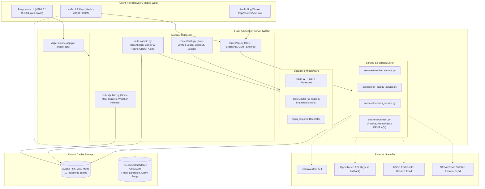

# 🇵🇭 LigtasPH: Integrated Calamity Response & Evacuation Mapping System

[](https://www.python.org/downloads/)
[](https://flask.palletsprojects.com/)
[-lightgrey.svg)](https://www.sqlite.org/)
[](https://leafletjs.com/)
[](tests/)
[](#license)
[](#)

**LigtasPH** is an integrated, resilient disaster-information and evacuation mapping platform engineered for residents, Local Government Units (LGUs), and Disaster Risk Reduction and Management Offices (DRRMO) across the Philippines.

The platform aggregates verified evacuation centers, real-time occupancy and relief supplies, multi-source weather forecasts, environmental safety metrics (PAGASA Heat Index & DENR DAO 2020-14 PM2.5 air quality), DOST Project NOAH hazard overlays, live earthquake and active fire telemetry, family location sharing, and geo-targeted emergency announcements.

> **Sprint 2 Highlight**: Features 836 live evacuation centers across all 17 Metro Manila LGUs parsed from authoritative GeoJSON (`data/ncr_evacuation_centers.geojson`), with 32 ungeocodable records quarantined for review. Unreported capacity defaults to `Status Unavailable` rather than fabricating fake zeroes or misleading "Available" statuses.

---

## 📑 Table of Contents
1. [Key Features](#-key-features)
2. [Architecture & System Design](#-architecture--system-design)
3. [Quick Start (Local Setup)](#-quick-start-local-setup)
4. [Available CLI Commands](#-available-cli-commands)
5. [REST API Reference](#-rest-api-reference)
6. [Database Schema & Architecture](#-database-schema--architecture)
7. [Environmental & Hazard Indicators](#-environmental--hazard-indicators)
8. [Configuration & Environment Variables](#-configuration--environment-variables)
9. [Project Directory Layout](#-project-directory-layout)
10. [Production Deployment](#-production-deployment)
11. [Security & Resilience](#-security--resilience)
12. [Testing & Quality Assurance](#-testing--quality-assurance)
13. [License](#-license)

---

## 🌟 Key Features

### 🗺️ Evacuation Center Mapping & Real NCR Dataset
- **Authoritative NCR Coverage**: Pre-loaded with 836 live evacuation centers across all 17 Metro Manila LGUs parsed from authoritative GeoJSON (`data/ncr_evacuation_centers.geojson`), with 32 quarantined rows in `staging_centers`.
- **Data Provenance & Verification Tracking**: Every center record tracks provenance tags (`source`, `verified`, `needs_review`, `review_reason`). Re-imports update coordinates without clobbering administrator-updated occupancy or supply counts.
- **Honest Capacity Representation**: Unreported capacity values remain `NULL` and display explicitly as `Status Unavailable` rather than fabricating fake zeroes or falsely reporting centers as "Available".
- **Real-Time Polling**: Frontend clients continuously poll `/api/centers/version` to dynamically refresh center data on directory, map, and detail views when updates are published.
- **Interactive Geospatial Visualization**: Powered by Leaflet with dynamic Mapbox 2D/3D terrain rendering and automatic fallback to OpenStreetMap tiles. Markers are color-coded by occupancy status with quick filters for city, operational state, and critical supplies.

### ⚠️ Project NOAH Multi-Hazard Overlays
- Pre-processed, optimized vector layers extracted from DOST Project NOAH shapefiles (`static/noah/`):
  - **5-Year Flood Hazard Maps** (`flood_mm_5yr.geojson`)
  - **Landslide Susceptibility Layers** (`landslide_mm.geojson`)
  - **Storm Surge Advisory Levels 1 through 4** (`stormsurge_ssa1.geojson` to `ssa4.geojson`)
- High-performance, lightweight client-side rendering with toggleable opacity and legend classification (Low, Moderate, High risk).

### 🌤️ Weather, PAGASA Heat Index & Air Quality
- **Resilient Multi-Provider Fallback**: Real-time forecasts queried from OpenWeather with automatic fallback to Open-Meteo (`Asia/Manila` timezone).
- **PAGASA Heat Index**: Calculated server-side using the NOAA/NWS Rothfusz regression equation and classified under official PAGASA alert tiers (*Not Hazardous*, *Caution*, *Extreme Caution*, *Danger*, *Extreme Danger*).
- **Air Quality Standards**: Evaluated via Open-Meteo Air Quality API (with OpenWeather Air Pollution fallback). Classifies PM2.5 concentrations strictly against **DENR DAO 2020-14** standards, keeping numeric US EPA AQI clearly distinguished.
- **Zero-Fabrication Integrity**: Never returns synthetic zeroes or default grids upon provider outages; returns HTTP `503 Service Unavailable` with `retry: true` and serves fresh cache (`<10 min`) or stale cache (`<1 hour`).

### 🌋 Live Hazard Feeds (USGS & NASA FIRMS)
- **Earthquake Radar**: Live telemetry from the USGS Earthquake Hazards Program, filtering seismic activity within a configurable radius (10–2000 km) around the Philippines.
- **Active Thermal / Wildfire Detection**: Integrates NASA FIRMS (Fire Information for Resource Management System) thermal anomaly satellite detection clamped to the Philippine bounding box.

### 👨‍👩‍👧‍👦 Family & Group Emergency Location Radar
- **Zero-Registration Privacy**: Users create temporary emergency groups that generate high-entropy 6-character alphanumeric invite codes.
- **Ephemeral Location Sharing**: Family members broadcast device GPS coordinates with accuracy metrics. Location pings automatically expire after 2 hours (auto-pruned in database).
- **Live Radar Map**: Shows relative positions of family members and nearby evacuation shelters in real time.

### 📢 Targeted Emergency Announcements
- Broadcast emergency alerts published by DRRMO administrators with severity tagging (`info`, `warning`, `critical`).
- Dynamic geographic targeting:
  - **All**: Nationwide broadcast.
  - **City**: Targeted strictly to selected LGU residents.
  - **Radius**: Proximity-based filtering using Haversine spherical distance calculations ($dist \le radius\_km$).

### 📞 Emergency Hotlines Directory
- Curated, verified repository of 29+ national disaster hotlines (NDRRMC, MMDA, PNP, BFP, Red Cross, DSWD, PAGASA, PHIVOLCS) and local LGU DRRMO hotlines.
- Instant search by locality and agency category, with direct one-tap telephone links (`tel:`) and clipboard copy shortcuts.

### 🔐 Administrative Portal & Audit Logging
- Role-based administrator console for municipal DRRMO officers.
- Real-time dashboard tracking total city capacity, aggregate occupancy, low-supply alerts, and stale records (`> 7 days without update`).
- Audit trail logging every center status update (`center_status_updates` table) capturing previous occupancy, new occupancy, supply states, timestamps, and the managing admin ID.

---

## 🏛️ Architecture & System Design



---

## 🚀 Quick Start (Local Setup)

### Prerequisites
- **Python 3.11+** (tested on 3.11 through 3.14)
- **pip** + **venv**
- **Git**

### 1. Clone & venv
```bash
git clone https://github.com/Makusu10/LigtasPH.git
cd LigtasPH

# Create virtual environment
python3 -m venv .venv

# Activate virtual environment
# Linux / macOS:
source .venv/bin/activate

# Windows CMD:
.venv\Scripts\activate

# Windows PowerShell:
.venv\Scripts\Activate.ps1
```

### 2. Install Dependencies
```bash
# In your virtual environment:
pip install -r requirements.txt

# Or directly via venv python:
.venv/bin/python -m pip install -r requirements.txt
```

### 3. Configure Environment
```bash
cp .env.example .env
# Optional: customize variables in .env if you have OpenWeather, Mapbox, or NASA FIRMS keys.
# Fallbacks are automatically active when keys are blank.
```

### 4. Initialize Database & Ingest Datasets
```bash
# Initialize 10 relational tables (foreign keys ON, WAL mode, CHECK constraints)
.venv/bin/python -m flask --app app init-db

# Seed admin user, emergency hotlines, and initial cache
.venv/bin/python -m flask --app app seed

# Ingest 836 real NCR evacuation centers from authoritative GeoJSON (idempotent)
.venv/bin/python -m flask --app app import-geojson
```

### 5. Run / Launch the Application

#### Option A: One-Click GUI Launcher (Recommended for Local Demo)
```bash
.venv/bin/python run_gui.py
```
- Auto-detects virtual environments (`.venv`, `venv`, `env`).
- Installs dependencies and runs `init-db` + `seed` automatically if the database file is missing.
- Opens `http://127.0.0.1:5000` directly in your default browser.

#### Option B: Manual Flask Development Server
```bash
# Linux / macOS (with active venv)
flask --app app run --debug

# Or directly via venv executable:
.venv/bin/python -m flask --app app run --debug
```

#### Option C: Production WSGI Server
```bash
.venv/bin/python -m gunicorn wsgi:app --bind 127.0.0.1:8000
```

---

### 🔑 Default Credentials & Access
| Portal | URL | Default Username | Default Password |
| :--- | :--- | :--- | :--- |
| **Admin Login** | `http://127.0.0.1:5000/admin/login` | `admin` | `admin123` |
| **Admin Dashboard** | `http://127.0.0.1:5000/admin/dashboard` | *(Protected)* | *(Session Required)* |

> [!CAUTION]
> **Brute-Force Policy**: Login attempts are rate-limited to **10 requests per minute**. After **5 consecutive failed attempts**, the account is locked for **15 minutes**. For production environments, non-default credentials are strictly enforced.

---

### 🔍 Troubleshooting Common Issues
- **`externally-managed-environment`**: Run commands using `.venv/bin/python -m ...` or ensure your virtual environment is active before invoking `pip`.
- **`ModuleNotFoundError: No module named 'flask'`**: Run `.venv/bin/python -m pip install -r requirements.txt`.
- **Port 5000 already in use**: Start Flask on an alternative port: `.venv/bin/python -m flask --app app run --port 5001`.
- **SQLite Database Locked**: Terminate any running Flask processes (`Ctrl+C`), then run `.venv/bin/python -m flask --app app init-db && .venv/bin/python -m flask --app app seed`.
- **Headless / WSL Browser Launch**: In WSL or headless servers, `run_gui.py` will display the local URL; open `http://127.0.0.1:5000` manually in your host browser.

---

## 🛠️ Available CLI Commands

| Command | Purpose | Notes |
| :--- | :--- | :--- |
| `.venv/bin/python -m flask --app app run --debug` | Start Flask development server with auto-reload | Runs on `http://127.0.0.1:5000` |
| `.venv/bin/python -m flask --app app init-db` | Build the 10 database tables, indexes, and constraints | Safe to run on existing DBs (adds missing tables) |
| `.venv/bin/python -m flask --app app seed` | Seed initial hotlines, default admin user, and sample data | Idempotent for hotlines; preserves existing data |
| `.venv/bin/python -m flask --app app import-geojson [path]` | Ingest real evacuation centers GeoJSON | Defaults to `data/ncr_evacuation_centers.geojson` |
| `.venv/bin/python -m pytest -q` | Run the complete automated test suite | Runs all 137 tests across 11 test modules |
| `.venv/bin/python run_gui.py` | Auto-provisioning demo launcher | Auto-creates venv, installs requirements, opens browser |
| `.venv/bin/python scripts/convert_noah.py` | Convert DOST-NOAH shapefiles to optimized GeoJSON | Dev tool (requires `pyshp`, `shapely`) |
| `.venv/bin/python -m gunicorn wsgi:app` | Start production WSGI web server | Used by Render / containerized environments |

---

## 📡 REST API Reference

All API routes are served under `/api` and are CSRF-exempt for client integration.

| Endpoint | Method | Parameters | Description |
| :--- | :---: | :--- | :--- |
| `/api/centers` | `GET` | `q`, `city`, `status`, `supply`, `sort` | Query evacuation centers with computed occupancy and supply statuses. |
| `/api/centers/version` | `GET` | *None* | Returns `max_updated_at` and `count` for client polling and cache invalidation. |
| `/api/centers/<id>` | `GET` | `id` (path) | Detailed evacuation center record including capacity, occupancy, and supplies. |
| `/api/ncr-lgus` | `GET` | *None* | Static list of all 17 Metro Manila LGUs with centroid geographic coordinates. |
| `/api/weather` | `GET` | `lat`, `lon`, or `city` | Current weather conditions, hourly strip, and calculated PAGASA Heat Index. |
| `/api/air-quality` | `GET` | `lat`, `lon`, or `city` | Real-time air quality metrics evaluated per DENR DAO 2020-14 PM2.5 and US AQI. |
| `/api/environment` | `GET` | `lat`, `lon`, or `city` | Unified endpoint returning weather, air quality, and composite overall severity. |
| `/api/earthquakes` | `GET` | `lat`, `lon`, `radius_km` (10–2000) | Live USGS earthquake events within radius of Philippine bounding box. |
| `/api/fires` | `GET` | `lat`, `lon`, `days` (1 or 2) | Active thermal anomaly satellite detections from NASA FIRMS. |
| `/api/announcements` | `GET` | `city`, `lat`, `lon` | Public emergency broadcast feed with spatial city and Haversine radius filtering. |
| `/api/groups` | `POST` | `{"name": "string"}` | Create a family/emergency location group; returns a 6-character invite code. |
| `/api/locations` | `POST` | `{"invite_code", "display_name", "lat", "lon", "accuracy"}` | Post ephemeral GPS telemetry for a group member (auto-expires in 2 hours). |
| `/api/groups/<code>/locations` | `GET` | `since` (optional ISO timestamp) | Retrieve active member locations for a group code (auto-prunes expired rows). |
| `/api/hotlines` | `GET` | `city`, `category`, `q` | Searchable directory of emergency hotlines with categorization and jurisdiction. |

---

## 🗄️ Database Schema & Architecture

The database is built on SQLite with `PRAGMA foreign_keys = ON` and Write-Ahead Logging (`journal_mode = WAL`) to support high-concurrency reads:

| Table Name | Primary Purpose | Key Columns & Constraints |
| :--- | :--- | :--- |
| `administrators` | DRRMO officer authentication | `id`, `username` (UNIQUE), `password_hash`, `failed_attempts`, `locked_until` |
| `evacuation_centers` | Live evacuation shelters | `name`, `address`, `city`, `lat`, `lng`, `capacity` (NULL allowed), `current_occupancy`, `food_status`, `water_status`, `medicine_status`, `hygiene_status`, `basic_needs_status`, `operational_status`, `verified`, `needs_review`, `archived` |
| `staging_centers` | Quarantine buffer for raw imports | `name`, `barangay`, `city`, `review_reason`, `raw_json`, `created_at` |
| `center_status_updates` | Historical status audit log | `center_id` (FK), `prev_occupancy`, `new_occupancy`, `food_status`, `water_status`, `medicine_status`, `admin_id` (FK), `updated_at` |
| `emergency_hotlines` | Verified emergency telephone directory | `agency`, `category` (CHECK enum), `contact_number`, `city`, `last_verified`, `archived` |
| `weather_cache` | Meteorological and AQI response cache | `city`, `lat`, `lng`, `source`, `payload` (JSON), `fetched_at` (10-min fresh / 1-hr stale) |
| `emergency_groups` | Ephemeral family sharing radar groups | `invite_code` (UNIQUE, 6 chars), `name`, `created_at` |
| `live_locations` | Ephemeral family member GPS pings | `group_id` (FK CASCADE), `display_name`, `lat`, `lng`, `accuracy`, `shared_at`, `expires_at` (2-hour TTL) |
| `hazards_cache` | USGS and NASA FIRMS cached telemetry | `cache_key` (UNIQUE), `payload` (JSON), `fetched_at` |
| `announcements` | Targeted emergency broadcasts | `title`, `message`, `scope` (`all`/`city`/`radius`), `city`, `center_lat`, `center_lng`, `radius_km`, `severity` (`info`/`warning`/`critical`), `starts_at`, `ends_at`, `is_active` |

---

## 🌡️ Environmental & Hazard Indicators

### PAGASA Heat Index Calculation
The Heat Index measures perceived temperature based on dry-bulb temperature ($T$ in °F) and relative humidity ($R$ in %):

$$\text{HI} = -42.379 + 2.04901523 T + 10.14333127 R - 0.22475541 T R - 6.83783 \times 10^{-3} T^2 - 5.481717 \times 10^{-2} R^2 + \dots$$

Calculated values are mapped to official PAGASA warning tiers:
- 🟢 **< 27°C**: *Not Hazardous* — Low risk of heat-related illness.
- 🟡 **27°C – 32°C**: *Caution* — Fatigue possible with prolonged exposure.
- 🟠 **33°C – 41°C**: *Extreme Caution* — Heat cramps and heat exhaustion possible.
- 🔴 **42°C – 51°C**: *Danger* — Heat exhaustion likely; heat stroke possible with continued activity.
- 🟣 **$\ge$ 52°C**: *Extreme Danger* — Heat stroke imminent.

### DENR DAO 2020-14 PM2.5 Standards
Airborne fine particulate matter (PM2.5 in $\mu g/m^3$) is classified under Philippine Department of Environment and Natural Resources guidelines:
- **0.0 – 25.0 $\mu g/m^3$**: Good
- **25.1 – 35.0 $\mu g/m^3$**: Fair
- **35.1 – 45.0 $\mu g/m^3$**: Unhealthy for Sensitive Groups
- **45.1 – 55.0 $\mu g/m^3$**: Very Unhealthy
- **55.1 – 90.0 $\mu g/m^3$**: Acutely Unhealthy
- **> 91.0 $\mu g/m^3$**: Emergency

> [!NOTE]
> **Zero-Fabrication Guarantee**: External API failures never return dummy data or synthetic 0s. The system serves fresh cache ($<10$ min), stale cache ($<1$ hr), or returns HTTP `503 Service Unavailable` with `retry: true`.

---

## ⚙️ Configuration & Environment Variables

| Variable | Required | Default | Purpose |
| :--- | :---: | :--- | :--- |
| `SECRET_KEY` | **Yes (Prod)** | `dev-change-me-...` | Secret key for cryptographic session signing and CSRF tokens. |
| `FLASK_ENV` | No | `development` | Environment mode (`development`, `production`, `testing`). |
| `DATABASE_URL` | No | `instance/ligtas.sqlite` | Path or connection URI for SQLite database. |
| `ADMIN_USERNAME` | **Yes (Prod)** | `admin` | Initial username for seeded administrator account. |
| `ADMIN_PASSWORD` | **Yes (Prod)** | `admin123` | Initial password for seeded administrator account. |
| `OPENWEATHER_API_KEY`| Optional | `""` | OpenWeather API key. If omitted, keyless Open-Meteo is used automatically. |
| `MAPBOX_TOKEN` | Optional | `""` | Public `pk.*` Mapbox GL token for 2D/3D map. Falls back to OpenStreetMap if blank. |
| `FIRMS_MAP_KEY` | Optional | `""` | NASA FIRMS MAP key for thermal satellite telemetry. |
| `GEMINI_API_KEY` | Optional | `""` | Reserved for AI disaster assistance capabilities. |
| `APP_URL` | Optional | `""` | Base URL of deployed application instance. |

---

## 📁 Project Directory Layout

```text
LigtasPH/
├── app.py                     # Flask application factory, CLI commands, blueprint setup
├── config.py                  # Environment configurations (Development, Production, Testing)
├── wsgi.py                    # WSGI entrypoint for Gunicorn/production
├── run_gui.py                 # Standalone GUI demo launcher with auto-provisioning
├── requirements.txt           # Python dependency manifest
├── runtime.txt                # Target Python runtime for cloud deployment
├── Procfile                   # Process definition for Render / Heroku
│
├── data/
│   └── ncr_evacuation_centers.geojson  # 868 raw features from NCR dataset
│
├── routes/
│   ├── public.py              # Public views: Home, Directory, Detail, Weather, Hotlines, Map
│   ├── auth.py                # Admin authentication, rate-limited login, session handling
│   ├── admin.py               # Protected DRRMO administration portal & CRUD operations
│   └── api.py                 # REST API endpoints (centers, weather, air quality, hazards)
│
├── services/
│   ├── weather_service.py     # Weather provider integration & cache management
│   ├── air_quality_service.py # Open-Meteo / OpenWeather air quality fetchers
│   └── hazards_service.py     # USGS earthquakes & NASA FIRMS thermal telemetry
│
├── utils/
│   ├── db.py                  # Database connection handling, schema definitions & migrations
│   ├── seed.py                # Database seeder for demo centers, hotlines, and admin users
│   ├── environment.py         # Rothfusz Heat Index regression & DENR AQI calculators
│   ├── validators.py          # Input validation helpers (coordinates, phone numbers)
│   ├── security.py            # Route authentication decorators
│   └── ratelimit.py           # Shared Flask-Limiter extension instance
│
├── scripts/
│   ├── import_evac_centers.py # Offline/CLI importer for evacuation center GeoJSON
│   └── convert_noah.py        # Build-time converter for DOST-NOAH shapefiles
│
├── templates/
│   ├── base.html              # Core layout with Material Design 3 liquid-glass styling
│   ├── public/                # Public templates (home, map, directory, weather, hotlines)
│   ├── admin/                 # Admin console (dashboard, centers, hotlines, announcements)
│   ├── partials/              # Reusable template components (navbars, modals, cards)
│   └── errors/                # Custom error pages (400, 401, 403, 404, 500)
│
├── static/
│   ├── css/                   # Responsive styles, design tokens, liquid-glass effects
│   ├── js/                    # Vanilla JavaScript client logic, Leaflet map controllers
│   ├── noah/                  # Pre-converted NOAH flood, landslide, and surge GeoJSON
│   └── images/                # Brand assets, logos, and UI icons
│
└── tests/
    ├── conftest.py            # Pytest fixtures and shared in-memory test database
    ├── test_sprint1.py        # Core MVP regression test suite
    ├── test_sprint2_geojson.py# GeoJSON import, normalization, and quarantine test suite
    ├── test_admin_crud.py     # Admin authentication, center editing, and audit trail tests
    ├── test_announcements.py  # Targeted emergency alerts and Haversine spatial tests
    ├── test_environment.py    # Heat index, AQI classification, and 503 fallback tests
    ├── test_hazards.py        # USGS earthquake & NASA FIRMS feeds tests
    ├── test_mapbox.py         # Mapbox 2D/3D map integration and OSM fallback tests
    ├── test_noah.py           # Project NOAH vector overlay validation tests
    ├── test_sharing.py        # Family location radar and 2-hour TTL expiration tests
    └── test_splash.py         # Session splash screen logic tests
```

---

## ☁️ Production Deployment

### Option 1: Render (PaaS)
1. Fork or push the repository to GitHub.
2. In Render, create a new **Web Service** linked to your repository.
3. Configure the build parameters:
   - **Environment**: `Python`
   - **Build Command**: `pip install -r requirements.txt && flask --app app init-db && flask --app app seed && flask --app app import-geojson`
   - **Start Command**: `gunicorn wsgi:app`
4. Set Environment Variables in the Render Dashboard:
   - `FLASK_ENV=production`
   - `SECRET_KEY=<generate-strong-64-character-hex-string>`
   - `ADMIN_USERNAME=<your-custom-admin-username>`
   - `ADMIN_PASSWORD=<your-secure-admin-password>`
   - *(Optional)* `OPENWEATHER_API_KEY`, `MAPBOX_TOKEN`, `FIRMS_MAP_KEY`
5. Mount a persistent disk at `instance/` to retain administrative updates across deployments.

### Option 2: Docker Container
```dockerfile
FROM python:3.11-slim

WORKDIR /app
COPY requirements.txt .
RUN pip install --no-cache-dir -r requirements.txt

COPY . .
RUN python -m flask --app app init-db && \
    python -m flask --app app seed && \
    python -m flask --app app import-geojson

EXPOSE 8000
CMD ["gunicorn", "--bind", "0.0.0.0:8000", "--workers", "4", "wsgi:app"]
```

---

## 🛡️ Security & Resilience

- **Authentication**: Passwords are encrypted using Werkzeug's secure implementation of PBKDF2 with SHA-256 salts.
- **Brute-Force Defense**: Login endpoint is rate-limited to 10 attempts/min. Accounts are locked for 15 minutes after 5 consecutive failed attempts.
- **Session Protection**: Session cookies enforce `HttpOnly` flags, `SameSite=Lax` isolation, and `Secure` attributes in production.
- **CSRF Defense**: All state-modifying administrative POST/PUT requests require valid Flask-WTF CSRF tokens. Public REST APIs under `/api` are explicitly exempted.
- **SQL Injection Prevention**: All queries utilize parameterized SQLite bindings; raw string interpolation into SQL queries is strictly prohibited.
- **Privacy by Design**: Live emergency location sharing relies on ephemeral records that automatically expire after 2 hours. Group invite codes are generated using cryptographically secure pseudorandom token generators (`secrets` module).
- **Graceful Degradation**: External API failures never crash the platform or fabricate misleading placeholder data; instead, honest `503 Service Unavailable` signals with retry indicators are returned.

---

## 🧪 Testing & Quality Assurance

LigtasPH maintains a comprehensive automated test suite consisting of **137 test cases** covering all critical paths:

```bash
# Execute the complete test suite
.venv/bin/python -m pytest -q

# Run a specific test module
.venv/bin/python -m pytest -q tests/test_sprint2_geojson.py

# Run a targeted test case
.venv/bin/python -m pytest -q tests/test_announcements.py::test_announcements_radius_filter
```

### Test Suite Highlights
- **Spatial Calculations**: Verifies Haversine formula correctness for radius-targeted emergency announcements.
- **Resilient Fallbacks**: Simulates complete network/provider blackouts to ensure the system returns proper 503 statuses instead of fabricated zeroes.
- **Data Normalization**: Validates city name mapping, address deduplication, and quarantine isolation of unverified coordinates.
- **Audit Trails**: Confirms that administrative updates to center occupancy accurately append historical records in `center_status_updates`.

---

## 📄 License

Developed for academic and civic disaster-resilience use. Sample data and demonstration records are marked for development and educational validation. Released under the [MIT License](LICENSE).

